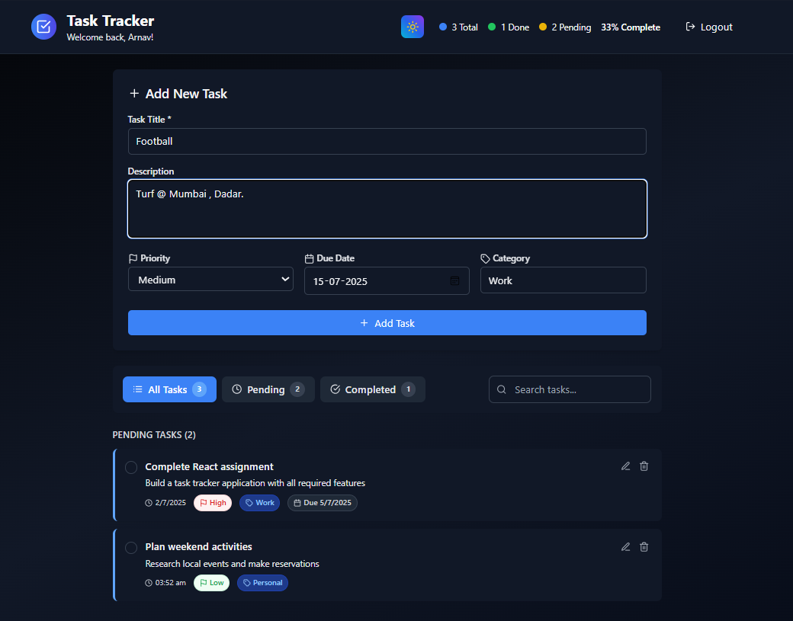
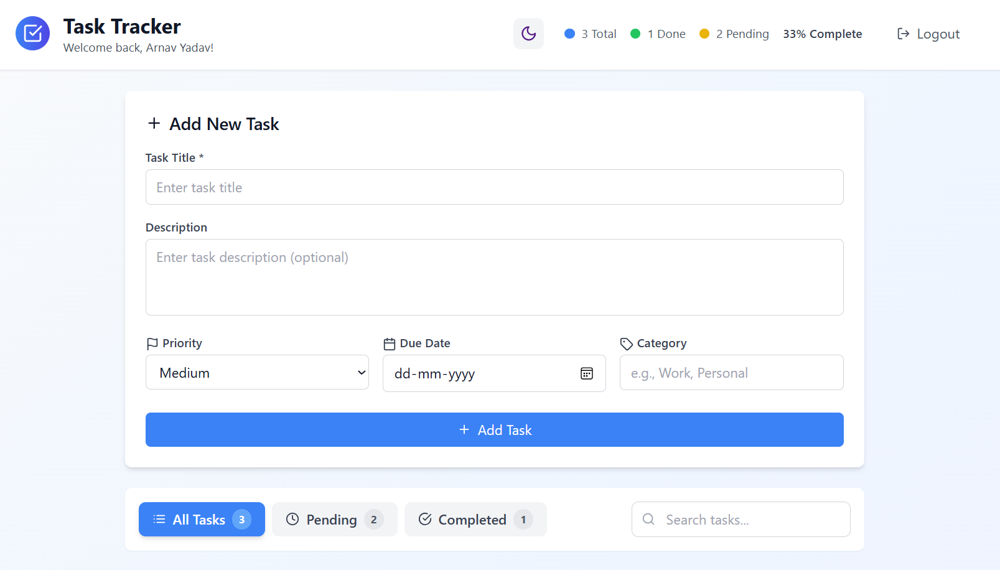
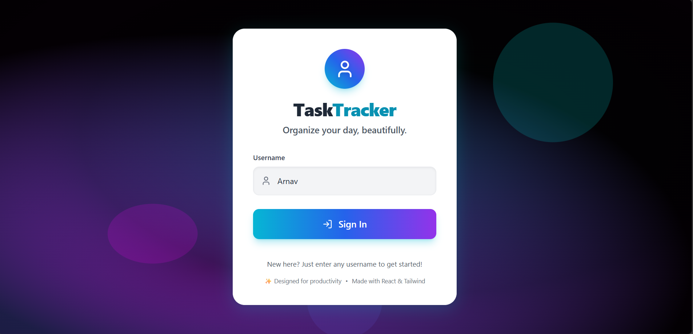
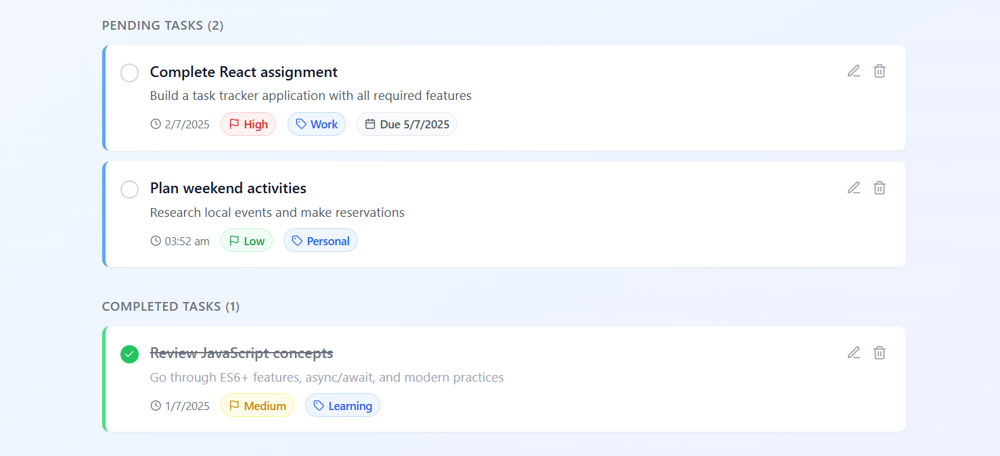

# Task Tracker

A modern, visually appealing task management app built with **React**, **Vite**, and **Tailwind CSS**.

## ✨ Features

- ⚡ Fast and responsive UI with Vite + React
- 🎨 Beautiful neon-inspired dark/light themes
- 🔒 Simple login (username only, no password)
- ✅ Track total, completed, and pending tasks
- 📊 Completion stats and progress
- 🌗 Theme toggle (dark/light mode)
- 📱 Mobile-friendly and responsive design

## 🌐 Live Demo

Try it out: [https://task-tracker-green-delta.vercel.app/](https://task-tracker-green-delta.vercel.app/)

## 🚀 Getting Started

### 1. Install dependencies

```bash
npm install
```

### 2. Start the development server

```bash
npm run dev
```

Open [http://localhost:5173](http://localhost:5173) to view the app.

## 🛠️ Tech Stack

- [React](https://react.dev/)
- [Vite](https://vitejs.dev/)
- [Tailwind CSS](https://tailwindcss.com/)
- [Lucide Icons](https://lucide.dev/)

## 📁 Project Structure

- `src/components/` — React components (Login, Header, etc.)
- `src/` — Main app logic and styles

## 📸 Screenshots


### Homepage (Dark)


### Homepage (Light)


### Login Page


### Pending Task


## 📄 License

MIT

---

Made with ❤️ for productivity.
